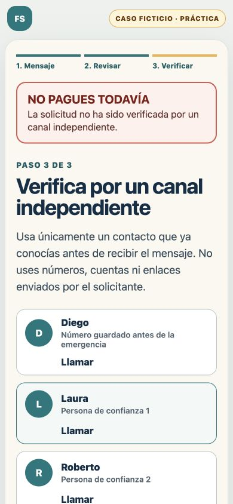

# Family Shield Persona Walkthrough

**Student:** David Buzali  
**Persona:** Elena, 67, retired, living alone in Mexico City  
**Viewport:** 390 x 844 px  
**Deployment tested first:** https://family-shield-week-3.vercel.app  
**Date:** 2026-08-29

## Method and limitation

The student chose to run the persona walkthrough in the existing working conversation so the full implementation context remained available. This makes the exercise less independent than the fresh-conversation method in the packet. To reduce confirmation bias, each judgment used only the visible screen and treated implementation details not shown to Elena as unavailable.

Elena's evaluation stance was: read carefully, assume a frightened relative may be in danger, avoid technical interpretation, state the next action, and identify any point where fear of pressing the wrong control could cause abandonment.

## Persona findings

| Screen | Elena's interpretation | Hesitation | Severity | Decision |
|---|---|---|---|---|
| Start | Pause before paying and verify the request another way | The urgent-flow and practice buttons require a short read | Low | Keep the actions visually distinct |
| Upload and privacy | Add the screenshot, but use only fictional data in this prototype | "Proveedor externo de IA" is mildly technical | Low | Consider plainer provider language later |
| Organized summary | The app reorganized the claim but did not authenticate Diego | The screen inherited the prior scroll position and hid most of "NO PAGUES TODAVÍA" | High | Fix immediately |
| Warning and family code | The AI cannot establish who sent the message; JACARANDA does not permit payment | None | None | Preserve the copy |
| Independent contacts | Call a number known before the emergency, never one from the message | The inherited scroll could also hide the stop banner here | High | Cover with the same fix |
| Diego unavailable | Try Laura or Roberto because Diego did not answer | None | None | Preserve the backup path |
| Protocol Only | Do not pay; waiting and following the protocol is the correct outcome | "Only" is less natural than the surrounding Spanish | Medium | Consider "SOLO PROTOCOLO" later |

## Highest-severity correction

The organized-summary and independent-verification screens retained the previous page's mobile scroll position. The defect could cause Elena to miss the strongest safety instruction at precisely the moment she moved from reading the suspicious request to acting on it.

The correction resets the window to the top on every flow-step change and repeats the reset on the next animation frame. This keeps the complete "NO PAGUES TODAVÍA" banner visible when each new screen opens.

## Retest

The affected transitions were repeated locally at 390 x 844 px after the correction:

- Upload to organized summary: passed. The complete stop banner is visible first.
- Organized summary to independent verification: passed. The complete stop banner and verification heading are visible on entry.
- Existing safety suite: passed, 15 of 15 tests.
- Production build: passed.

## Persona success decision

The persona walkthrough passes its behavioral criteria. Elena understands that the AI did not authenticate Diego, the family word does not authorize payment, verification must use a previously established contact, and Protocol Only means waiting is the correct protective action rather than a personal failure.

Deployment 2 will be recorded after the corrected public URL is verified.
